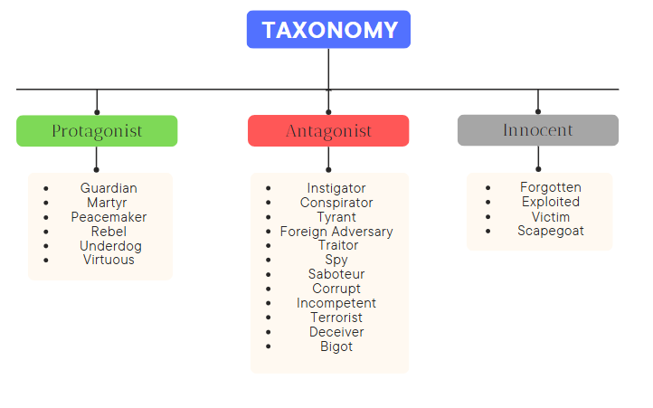

# EntityFraming-Llama3-8b-Instruct
Fine-tuning process for the multi-class multi-label classification task on entities mentioned within news articles. This research was conducted for the SemEval 2025 campaign, specifically for [Task 10: Multilingual Characterization and Extraction of Narratives from Online News](https://propaganda.math.unipd.it/semeval2025task10/). Specifically, the proposed entity framing task is as follows: given an article and a list of entities mentioned within it, assign each individual one or more roles, based on a predefined taxonomy. 

The task is considered as a textual classification problem at the level of specific span sentence fragments, and is both multi-class, due to the numerous possible entities defined, and multi-label, since more than one entity may be associated to each single instance.

## File Description
 - Pre-processing: The pre-processing phase aims to create the final dataset to be used for model training. In order to be able to carry out the process, it is necessary to have the file with the annotations and articles available. 
 - DataAugmentation: Script for the creation of new annotations, which allow for a greater characterisation of sub-classes that are considered deficient. The eight-billion-parameter version of the Llama 3 model is used for the generation of the new sentences.
 - FineTuningLlama38b: This notebook contains the main steps leading to the fine-tuning of the model. The input is the dataset produced by the pre-processing step. Access to the model on HuggingFace and an account on Weights and Biases are required. For the realisation of the fine-tuning process, the basic scheme proposed within this article was used: [https://www.datacamp.com/tutorial/fine-tuning-llama-3-1](https://www.datacamp.com/tutorial/fine-tuning-llama-3-1)
 - ConfusionMatrix: Script for generating the confusion matrix for evaluating model performance.

  
## License
This project is licensed under the MIT License
